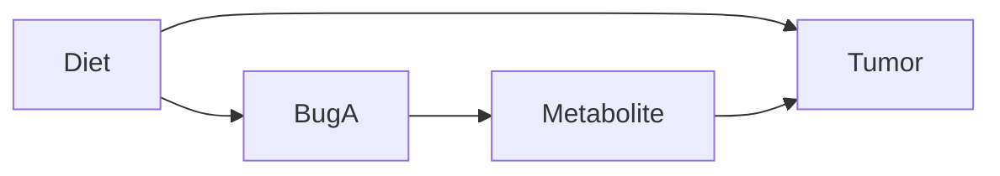

# Causal-ish Omics: A Practical Guide with a Toy Microbiome → Metabolite → Outcome Example

This repo is a guide for people doing microbiome / metabolomics / multi-omics who want to get **closer** to causal answers.

It covers two common "causal-ish" tools:

1. **Causal Mediation Analysis** (ACME / ADE / Total effect; e.g. the R package `mediation`)
2. **Double Machine Learning (DML)** (a way to estimate causal effects while using machine learning for confounder adjustment)

It also explains the "must-know" concepts that make these methods make sense:
- Association vs causal effect
- Bias (what it is)
- DAGs (Directed Acyclic Graphs)
- Confounders, mediators, colliders
- The backdoor criterion (what to adjust for, and what *not* to adjust for)
- Why compositionality matters (microbiome relative abundances)

**Important honesty statement:**  
None of this creates causality out of thin air. These methods give *causal interpretations only if the assumptions are believable* (especially "no unmeasured confounding").

---

## Quickstart (run the companion code)

- Inspect the toy data: `python python/01_toy_data.py` or `Rscript r/01_toy_data.R`
- DML “leftovers + cross-fitting” demo (Python): `python python/02_dml_example.py`
- Mediation (ACME/ADE/Total; R): `Rscript r/02_mediation_mediation_pkg.R` (requires `mediation`)

## 0) The toy dataset (4 patients, 4 bugs, 1 metabolite, 1 outcome)

We will use a tiny dataset to make every step concrete.

We observe for each patient:
- Microbiome relative abundance of **Bug A, B, C, D** (they sum to 1)
- A serum **Metabolite M**
- An **Outcome** (e.g., tumor volume)

We will also include one extra variable:
- **Diet** (0 = low fiber, 1 = high fiber)

Why include Diet? Because without *some* confounder, there is nothing to "adjust away", and we can't illustrate why causal thinking matters.

### Data

| Patient | Diet (Z) | Bug A | Bug B | Bug C | Bug D | Metabolite M | Tumor volume (Y) |
|--------:|:--------:|------:|------:|------:|------:|-------------:|-----------------:|
| P1      | 0        | 0.10  | 0.55  | 0.25  | 0.10  | 1.0          | 80               |
| P2      | 0        | 0.15  | 0.50  | 0.25  | 0.10  | 1.1          | 78               |
| P3      | 1        | 0.40  | 0.20  | 0.25  | 0.15  | 2.0          | 55               |
| P4      | 1        | 0.45  | 0.15  | 0.25  | 0.15  | 2.1          | 50               |

### The biological story we want to reason about

We *suspect*:
- Diet affects the microbiome and tumor (Diet is a confounder)
- Bug A changes a metabolite
- The metabolite changes tumor volume

That is the path:

**Bug A → Metabolite M → Tumor volume**

### Variable names (we will reuse these everywhere)

- **Exposure / treatment** `X` = `BugA` (microbe feature we “pretend we could change”)
- **Mediator** `M` = `Metabolite` (in-between variable on the pathway)
- **Outcome** `Y` = `Tumor` (what we care about changing)
- **Confounder** `Z` = `Diet` (a common cause of `X` and `Y`)

---

## 1) Terms you must know (without assuming background)

### 1.0 Exposure, outcome, confounder, mediator (roles)
- **Exposure (X)**: the thing you want the effect *of* (here: `BugA`).
- **Outcome (Y)**: the thing you want the effect *on* (here: `Tumor`).
- **Confounder (Z)**: a *common cause* of X and Y (here: `Diet`).
- **Mediator (M)**: an *in-between* variable on the pathway X → M → Y (here: `Metabolite`).

### 1.1 Association vs causal effect
- **Association**: two variables move together in the data.
  - Example: "Patients with higher Bug A tend to have smaller tumors."
- **Causal effect**: changing one variable would change another variable.
  - Example: "If we could increase Bug A (holding other causes fixed), tumor volume would decrease."

Association is easy to see. Causal effect requires assumptions or experiments.

### 1.2 "Bias" (what it means)
**Bias** means your estimate is *systematically wrong*, even if you had infinite data.

- **Random error**: noise that averages out with more samples.
- **Bias**: a consistent distortion that does **not** go away with more samples.

Common causal biases:
- **Confounding bias**: mixing up "A causes Y" with "something else causes both A and Y".
- **Adjustment bias**: "controlling for" the wrong variable (like a mediator or a collider).

### 1.3 "Controlling for / adjusting for" a variable
"Adjusting for Z" means you compare people **as if Z were held fixed**, using one of these:
- regression with Z as a covariate
- matching on Z
- stratifying by Z
- weighting by Z (propensity scores)

In this guide, we usually mean the regression idea: include Z so comparisons happen *within similar Z*.

---

## 2) DAGs: the picture-language of causal thinking

A **DAG (Directed Acyclic Graph)** is just:
- nodes = variables
- arrows = "direct causal influence"
- no cycles (no feedback loops in the diagram)

### 2.1 Our toy DAG (what we *think* is happening)

Read this as:
- Diet influences Bug A
- Diet influences Tumor
- Bug A influences Metabolite
- Metabolite influences Tumor

### 2.2 Confounders, mediators, colliders (the three roles that matter)

#### Confounder
A confounder is a variable that affects both the exposure and the outcome. In our DAG:
- Diet affects Bug A
- Diet affects Tumor
So Diet is a confounder for the relationship Bug A → Tumor.

Why it matters: If you ignore Diet, you might think Bug A causes tumor changes, when actually Diet is the driver.

#### Mediator
A mediator is a variable that lies on the causal pathway from exposure to outcome. In our DAG:
- Bug A affects Metabolite
- Metabolite affects Tumor
So Metabolite is a mediator of Bug A’s effect on Tumor.

Why it matters: If you "control for" a mediator while trying to estimate the total effect, you can erase the effect you’re trying to measure.

#### Collider
A collider is a variable with two arrows pointing into it (a *common effect*).

In this repo’s **main toy DAG**, `Metabolite` is a *mediator*, not a collider. A collider example that stays realistic in omics is **selection / missingness**:

- Suppose you only measure `Metabolite` for patients with “good samples”.
- If “good sample” is more likely when `BugA` is high *and* when `Tumor` is high, then conditioning on “Metabolite measured” can act like conditioning on a collider.

Why it matters: If you adjust for a collider (or analyze only a collider-defined subset), you can create a fake BugA–Tumor association even if none exists.

---

## 3) The backdoor idea (how to decide what to adjust for)

### 3.1 What is a "backdoor path"?
A backdoor path is any path from Exposure (X) to Outcome (Y) that starts with an arrow into X. In our main DAG: BugA ← Diet → Tumor. This is a backdoor path (it starts with an arrow into BugA).

### 3.2 Backdoor rule (plain language)
To estimate the causal effect of X on Y, adjust for variables that:
- block all backdoor paths from X to Y
- without controlling for mediators or colliders

In our case, to estimate BugA → Tumor:
- Adjusting for Diet blocks BugA ← Diet → Tumor
- Do not adjust for Metabolite if you want the total effect (because it is on the pathway)

### 3.3 Adjustment cheat-sheet for this toy DAG

| Question (always state this first) | Target effect | Adjust for | Do **not** adjust for |
|---|---|---|---|
| “What is the **total** causal effect of `BugA` on `Tumor`?” | Total effect | `Diet` | `Metabolite` (mediator) |
| “What is the **direct** effect of `BugA` on `Tumor` **not through** `Metabolite`?” | Direct effect (ADE) | `Diet`, `Metabolite` | Colliders / selection variables |
| “What is the effect of `Metabolite` on `Tumor`?” | Effect of M on Y | `Diet`, `BugA` (because `BugA` causes `Metabolite` and `Tumor`) | Colliders / selection variables |

---

## 4) Microbiome compositionality (why relative abundance changes things)

Microbiome abundances are often compositional:
Bug A + Bug B + Bug C + Bug D = 1

That creates a trap:
If Bug A goes up, at least one of B/C/D must go down (even if biology didn’t change, just measurement/normalization).

This can create misleading associations.

### 4.1 What to do about it (practical)
A common fix is to work in log-ratio space, e.g.:
- CLR (centered log-ratio)
- ALR (additive log-ratio)
- or specific log-ratios like log(A/B)

In this repo, you can:
- keep the toy data as relative abundance for intuition
- but in real analyses, prefer CLR/ALR before regression/DML/mediation

Key interpretation shift:
After CLR/ALR, "Bug A increases" really means "Bug A increases relative to the rest."

---

## 5) Tool #1: Causal Mediation Analysis (ACME / ADE / Total)

### 5.1 What problem it answers
Mediation analysis answers questions like:
- Total effect: "How much does Bug A affect Tumor overall?"
- Indirect (mediated) effect: "How much of that effect goes through Metabolite M?"
- Direct effect: "How much of Bug A’s effect is not through Metabolite M?"

### 5.2 The three key outputs (defined)
- Total effect: overall change in Y when X changes
- ACME (Average Causal Mediation Effect): the indirect part (X → M → Y)
- ADE (Average Direct Effect): the direct part (X → Y not through M)

And they relate like this: Total = ACME + ADE

### 5.3 Why "don’t control for mediators" is (usually) correct
If you want the total effect of BugA on Tumor, you generally should not adjust for Metabolite, because that blocks part of the causal pathway. But if you specifically want the direct effect, you do include Metabolite.

Different question, different adjustment.

### 5.4 How mediation is done (simple steps, no fancy math)
To study Bug A → Metabolite → Tumor, you fit two models:
- Mediator model: predict Metabolite from Bug A (and confounders)
  "Does Bug A shift the metabolite?"
- Outcome model: predict Tumor from Metabolite and Bug A (and confounders)
  "Does the metabolite predict tumor, even after accounting for Bug A?"

Then the mediation framework combines these to estimate:
ACME, ADE, Total

### 5.5 What do we adjust for in mediation?
If Diet affects both Bug A and Tumor, it is a confounder and should be adjusted for.

So we include Diet in both models.
- Mediator model: Metabolite ~ BugA + Diet
- Outcome model: Tumor ~ BugA + Metabolite + Diet

### 5.6 Plain-language interpretation
If ACME is negative (for tumor volume), you’d say:
"Bug A appears to reduce tumor volume partly by increasing Metabolite M."

If ADE is also negative:
"Bug A also appears to reduce tumor volume through other routes beyond Metabolite M."

### 5.7 Assumptions (in human words)
Mediation needs stronger assumptions than "total effect" alone. The biggest one:
After controlling for measured confounders (like Diet), there should not be hidden factors that affect both Metabolite and Tumor.

If unmeasured variables drive both Metabolite and Tumor, ACME can be biased.

---

## 6) Tool #2: Double Machine Learning (DML)

### 6.1 What problem it answers
DML is for questions like:
- "What is the causal effect of Bug A on Tumor, controlling for lots of confounders?"
- "What is the causal effect of Bug A on Metabolite, controlling for lots of confounders?"

It is especially useful when:
- you have many covariates (multi-omics, many taxa, clinical variables)
- relationships are nonlinear
- you want valid uncertainty even though you used ML

### 6.2 What DML does (in plain language)
DML works by removing ("partialing out") what measured confounders can explain, then relating what’s left. For Bug A → Tumor, the key confounder in this toy story is `Diet` (in real omics you may have many more):

Practical microbiome note: if you include microbiome features in the adjustment set, prefer **log-ratios** (CLR/ALR) rather than raw relative abundances.

Step A: Predict Bug A from confounders
- Using Diet and other bugs, predict what Bug A "should be"
- Compute "leftover Bug A" = actual Bug A − predicted Bug A

Step B: Predict Tumor from confounders
- Using Diet and other bugs, predict what Tumor "should be"
- Compute "leftover Tumor" = actual Tumor − predicted Tumor

Step C: Link leftovers
- Ask: when leftover Bug A is higher, is leftover Tumor smaller?
- This last step estimates the effect while reducing confounding.

### 6.3 What is a "residual" / "leftover"?
Residual = actual value − predicted value

Example: Predict Bug A from Diet by using group means (toy-simple predictor):

Mean Bug A in Diet=0 group: (0.10 + 0.15)/2 = 0.125
Mean Bug A in Diet=1 group: (0.40 + 0.45)/2 = 0.425

Now leftovers:

| Patient | Diet | Bug A | Predicted Bug A (from Diet) | Leftover Bug A |
|--------:|-----:|------:|----------------------------:|---------------:|
| P1      | 0    | 0.10  | 0.125                       | -0.025         |
| P2      | 0    | 0.15  | 0.125                       | +0.025         |
| P3      | 1    | 0.40  | 0.425                       | -0.025         |
| P4      | 1    | 0.45  | 0.425                       | +0.025         |

Do the same for Tumor:

Mean Tumor in Diet=0: (80 + 78)/2 = 79
Mean Tumor in Diet=1: (55 + 50)/2 = 52.5

| Patient | Tumor | Predicted Tumor (from Diet) | Leftover Tumor |
|--------:|------:|----------------------------:|----------------:|
| P1      | 80    | 79.0                        | +1.0            |
| P2      | 78    | 79.0                        | -1.0            |
| P3      | 55    | 52.5                        | +2.5            |
| P4      | 50    | 52.5                        | -2.5            |

Now compare leftovers:

| Patient | Leftover Bug A | Leftover Tumor |
|--------:|----------------:|----------------:|
| P1      | -0.025          | +1.0            |
| P2      | +0.025          | -1.0            |
| P3      | -0.025          | +2.5            |
| P4      | +0.025          | -2.5            |

Within each Diet group, "more Bug A than expected" lines up with "smaller tumor than expected". That’s the core DML intuition.

### 6.4 Why is it "double" machine learning?
Because you use ML twice:
- once to predict the exposure (Bug A)
- once to predict the outcome (Tumor)
Then you do a simple final step linking leftovers.

### 6.5 Cross-fitting (why DML isn’t "cheating")
If you use ML to predict Bug A and Tumor on the same data, ML can overfit and accidentally remove real signal. DML avoids this by cross-fitting:
- split data into folds
- train prediction models on one fold
- compute leftovers on a different fold
- rotate and average

Toy datasets can’t show this well, but real DML always should.

### 6.6 What DML does NOT solve
It does not remove bias from unmeasured confounders.

It does not automatically decide what variables should be adjusted for (you still need DAG thinking).

If you adjust for mediators or colliders, DML can give very confident wrong answers.

---

## 7) How mediation and DML relate (and when to use which)

### 7.1 Mediation analysis is about decomposing an effect
Best when you want:
"How much is through Metabolite vs not?"

Outputs:
ACME (indirect), ADE (direct), Total

### 7.2 DML is about estimating an effect under complex adjustment
Best when you want:
"What is the effect of Bug A on Tumor controlling for lots of stuff?"
with high-dimensional covariates and flexible relationships

Outputs:
an effect estimate + uncertainty (for the chosen effect)

### 7.3 Which is "better"?
Neither is universally better.

If your goal is mechanism (microbe → metabolite → outcome): mediation is the natural framework.

If your goal is robust adjustment with many confounders: DML is often a better estimator.

---

## 8) Common failure modes (a.k.a. how to accidentally fool yourself)

### 8.1 "Adjusting for the mediator" when you want total effect
If you estimate BugA → Tumor and include Metabolite as a covariate, you may erase the pathway BugA → Metabolite → Tumor. That can make a real effect look like zero.

### 8.2 Adjusting for a collider
If Metabolite is influenced by both BugA and Tumor (BugA → Metabolite ← Tumor), adjusting for Metabolite can create a fake BugA–Tumor link.

### 8.3 Compositionality ignored
Using raw relative abundances in regression can create spurious relationships because of the sum-to-one constraint.

Prefer log-ratio transforms (CLR/ALR).

### 8.4 "Double dipping" feature selection
If you screen features for association and then test mediation only in those, p-values can become optimistic.

This is OK for discovery if you say so; be careful if claiming strict confirmatory inference.

## 9) Final takeaway

DAG thinking decides what you should adjust for.

Mediation answers "how much is through the metabolite?"

DML helps estimate effects when confounders are many/complex.

None of this replaces experiments, but it can make observational multi-omics analysis less misleading.

If you only remember one rule:
Adjust for confounders (common causes), not mediators (pathway variables), and not colliders (common effects).
