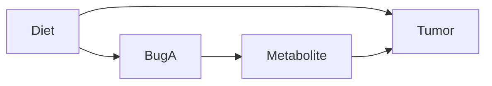

# Causal-ish Omics: A Practical Guide with a Toy Microbiome to Metabolite to Outcome Example

This repo is a guide for people doing microbiome / metabolomics / multi-omics who want to get **closer** to causal answers.

It covers two common "causal-ish" tools:

1. **Causal Mediation Analysis** (ACME / ADE / Total effect; e.g. the R package `mediation`)
2. **Double Machine Learning (DML)** (a way to estimate causal effects while using machine learning for confounder adjustment)

It also explains the "must-know" concepts that make these methods make sense:
- Association vs causal effect
- Bias (what it is)
- DAGs (Directed Acyclic Graphs)
- Confounders, mediators, colliders
- The backdoor criterion (what to adjust for, and what *not* to adjust for)
- Why compositionality matters (microbiome relative abundances)

**Important honesty statement:**
None of this creates causality out of thin air. These methods give *causal interpretations only if the assumptions are believable* (especially "no unmeasured confounding").

---

## Table of Contents

1. [Introduction: From association to causal questions](#1-introduction-from-association-to-causal-questions)
   1. [Why microbiome research often stays correlative](#11-why-microbiome-research-often-stays-correlative)
   2. [What causal inference can and cannot do](#12-what-causal-inference-can-and-cannot-do)
   3. [How to use this repo](#13-how-to-use-this-repo)
   4. [Key references (frameworks and packages)](#14-key-references-frameworks-and-packages)
   5. [Publications in microbiome spaces using DML or mediation analysis](#15-publications-in-microbiome-spaces-using-dml-or-mediation-analysis)
2. [Quickstart (run the companion code)](#2-quickstart-run-the-companion-code)
3. [The toy dataset (4 patients, 4 bugs, 1 metabolite, 1 outcome)](#3-the-toy-dataset-4-patients-4-bugs-1-metabolite-1-outcome)
   1. [Data](#31-data)
   2. [The biological story we want to reason about](#32-the-biological-story-we-want-to-reason-about)
   3. [Variable names (we will reuse these everywhere)](#33-variable-names-we-will-reuse-these-everywhere)
4. [Terms you must know (without assuming background)](#4-terms-you-must-know-without-assuming-background)
   1. [Exposure, outcome, confounder, mediator (roles)](#40-exposure-outcome-confounder-mediator-roles)
   2. [Association vs causal effect](#41-association-vs-causal-effect)
   3. [Bias (what it means)](#42-bias-what-it-means)
   4. [Controlling for / adjusting for a variable](#43-controlling-for-adjusting-for-a-variable)
5. [DAGs: the picture-language of causal thinking](#5-dags-the-picture-language-of-causal-thinking)
   1. [Our toy DAG (what we think is happening)](#51-our-toy-dag-what-we-think-is-happening)
   2. [Confounders, mediators, colliders (the three roles that matter)](#52-confounders-mediators-colliders-the-three-roles-that-matter)
6. [The backdoor idea (how to decide what to adjust for)](#6-the-backdoor-idea-how-to-decide-what-to-adjust-for)
   1. [What is a backdoor path?](#61-what-is-a-backdoor-path)
   2. [Backdoor rule (plain language)](#62-backdoor-rule-plain-language)
   3. [Adjustment cheat-sheet for this toy DAG](#63-adjustment-cheat-sheet-for-this-toy-dag)
7. [Microbiome compositionality (why relative abundance changes things)](#7-microbiome-compositionality-why-relative-abundance-changes-things)
   1. [What to do about it (practical)](#71-what-to-do-about-it-practical)
8. [Tool #1: Causal Mediation Analysis (ACME / ADE / Total)](#8-tool-1-causal-mediation-analysis-acme-ade-total)
   1. [What problem it answers](#81-what-problem-it-answers)
   2. [The three key outputs (defined)](#82-the-three-key-outputs-defined)
   3. [Why don’t control for mediators is usually correct](#83-why-dont-control-for-mediators-is-usually-correct)
   4. [How mediation is done (simple steps, no fancy math)](#84-how-mediation-is-done-simple-steps-no-fancy-math)
   5. [What do we adjust for in mediation?](#85-what-do-we-adjust-for-in-mediation)
   6. [Plain-language interpretation](#86-plain-language-interpretation)
   7. [Assumptions (in human words)](#87-assumptions-in-human-words)
9. [Tool #2: Double Machine Learning (DML)](#9-tool-2-double-machine-learning-dml)
   1. [What problem it answers](#91-what-problem-it-answers)
   2. [What DML does (in plain language)](#92-what-dml-does-in-plain-language)
   3. [What is a residual / leftover?](#93-what-is-a-residual-leftover)
   4. [Why is it double machine learning?](#94-why-is-it-double-machine-learning)
   5. [Cross-fitting (why DML isn’t cheating)](#95-cross-fitting-why-dml-isnt-cheating)
   6. [What DML does NOT solve](#96-what-dml-does-not-solve)
10. [How mediation and DML relate (and when to use which)](#10-how-mediation-and-dml-relate-and-when-to-use-which)
   1. [Mediation analysis is about decomposing an effect](#101-mediation-analysis-is-about-decomposing-an-effect)
   2. [DML is about estimating an effect under complex adjustment](#102-dml-is-about-estimating-an-effect-under-complex-adjustment)
   3. [Which is better?](#103-which-is-better)
11. [Common failure modes (how to accidentally fool yourself)](#11-common-failure-modes-how-to-accidentally-fool-yourself)
   1. [Adjusting for the mediator when you want total effect](#111-adjusting-for-the-mediator-when-you-want-total-effect)
   2. [Adjusting for a collider](#112-adjusting-for-a-collider)
   3. [Compositionality ignored](#113-compositionality-ignored)
   4. [Double dipping feature selection](#114-double-dipping-feature-selection)
12. [Final takeaway](#12-final-takeaway)
13. [Additional causal inference frameworks to consider](#13-additional-causal-inference-frameworks-to-consider)
14. [Further reading](#14-further-reading)

---

## 1) Introduction: From association to causal questions

Microbiome research has delivered many useful patterns. It has also produced a lot of results that do not replicate or do not translate into interventions. A common reason is that many studies answer "what is associated with what?" but not "what causes what?"

### 1.1 Why microbiome research often stays correlative

Early microbiome work (for example, many 16S surveys) was mainly descriptive. The goal was to map which microbes were present and how they differed across groups. That phase was valuable, but it set a culture where "microbe X is associated with outcome Y" is treated like a result, even when the causal story is unclear.

There are also practical and social reasons. Causal work asks you to state assumptions, name likely confounders, and justify adjustment choices. That is harder than running a set of simple tests, and it often leads to smaller or null effects. It can also be harder to publish careful null results than exciting associations.

This is problematic because microbiome data are highly correlated and compositional (everything sums to 100%). That makes spurious links easy to find. If we keep chasing unstable associations, we can waste resources and miss real mechanisms.

### 1.2 What causal inference can and cannot do

Observational causal inference does not replace randomized experiments. It cannot remove bias from unmeasured confounders, and it cannot turn weak data into proof.

What it can do is help you ask sharper questions and be more honest about what your data can support. It forces you to write down a causal story (often as a DAG), decide what to adjust for, and check whether your conclusions depend on assumptions you would not defend.

In practice, use causal methods as careful hypothesis generation. They can help you decide which microbes and pathways to test next, and which experiments would be most informative. Definitive evidence still comes from perturbation, randomization, and well-controlled study design.

### 1.3 How to use this repo

This is a small, concrete walkthrough using toy data. It is designed to build intuition, not to be a full pipeline.

- If you want a fast run-through, start with the Quickstart section and run the scripts.
- If you want the causal logic, read the DAG and backdoor sections before looking at the models.
- If you want to apply this to real multi-omics, use the "Additional frameworks" section to pick a method that matches your study design.

### 1.4 Key references (frameworks and packages)

If you want the original papers and the most common software implementations used in practice:

- Double machine learning (theory): Chernozhukov et al. (2018), "Double/debiased machine learning for treatment and structural parameters", *The Econometrics Journal*. https://arxiv.org/abs/1608.00060
- Double machine learning (Python implementation): Bach et al. (2022), "DoubleML: An Object-Oriented Implementation of Double Machine Learning in Python", *Journal of Machine Learning Research*. https://www.jmlr.org/papers/v23/21-0867.html
- Causal mediation analysis (theory): Imai, Keele, and Tingley (2010), "A General Approach to Causal Mediation Analysis", *Psychological Methods*. https://doi.org/10.1037/a0020761
- Causal mediation analysis (R implementation): Tingley et al. (2014), "mediation: R Package for Causal Mediation Analysis", *Journal of Statistical Software*. https://www.jstatsoft.org/article/view/v059i05

### 1.5 Publications in microbiome spaces using DML or mediation analysis

Recent microbiome papers use causal methods to move from links to testable effect and mechanism questions. A few examples to skim:

- Wu et al. (2025), *Nature Medicine*: "Microbiome–metabolome dynamics associated with impaired glucose control and responses to lifestyle changes". https://doi.org/10.1038/s41591-025-03642-6
- Litichevskiy et al. (2025), *Nature Microbiology*: "Microbiome ageing in genetically diverse mice". https://doi.org/10.1038/s41564-025-01964-2
- Chen et al. (2024), *Gut Microbes*: "Machine learning-causal inference based on multi-omics data reveals the association of altered gut bacteria and bile acid metabolism with neonatal jaundice". https://doi.org/10.1080/19490976.2024.2388805
- Wu et al. (2022), *Journal of Advanced Research*: "Gut microbiota specifically mediates the anti-hypercholesterolemic effect of berberine (BBR) and facilitates to predict BBR’s cholesterol-decreasing efficacy in patients". https://doi.org/10.1016/j.jare.2021.07.011
- Chen, Nguyen, and Liu (2025), *Journal of Data Science*: "High-dimensional Confounding in Causal Mediation: A Comparison Study of Double Machine Learning and Regularized Partial Correlation Network". https://doi.org/10.6339/25-jds1169

---

## 2) Quickstart (run the companion code)

Python scripts assume Python 3.10+ and the small dependencies listed in `pyproject.toml` (NumPy and pandas). A simple setup is:

- `python -m venv .venv && source .venv/bin/activate`
- `pip install -e .`

- Inspect the toy data: `python python/01_toy_data.py` or `Rscript r/01_toy_data.R`
- DML demo using the `doubleml` package (Python): `python python/02_dml_example.py`
- Mediation (ACME/ADE/Total; R): `Rscript r/02_mediation_mediation_pkg.R` (requires `mediation`)

## 3) The toy dataset (4 patients, 4 bugs, 1 metabolite, 1 outcome)

We will use a tiny dataset to make every step concrete.

We observe for each patient:
- Microbiome relative abundance of **Bug A, B, C, D** (they sum to 1)
- A serum **Metabolite M**
- An **Outcome** (e.g., tumor volume)

We will also include one extra variable:
- **Diet** (0 = low fiber, 1 = high fiber)

Why include Diet? Because without *some* confounder, there is nothing to "adjust away", and we can't illustrate why causal thinking matters.

### 3.1 Data

| Patient | Diet (Z) | Bug A | Bug B | Bug C | Bug D | Metabolite M | Tumor volume (Y) |
|--------:|:--------:|------:|------:|------:|------:|-------------:|-----------------:|
| P1      | 0        | 0.10  | 0.55  | 0.25  | 0.10  | 1.0          | 80               |
| P2      | 0        | 0.15  | 0.50  | 0.25  | 0.10  | 1.1          | 78               |
| P3      | 1        | 0.40  | 0.20  | 0.25  | 0.15  | 2.0          | 55               |
| P4      | 1        | 0.45  | 0.15  | 0.25  | 0.15  | 2.1          | 50               |

### 3.2 The biological story we want to reason about

We *suspect*:
- Diet affects the microbiome and tumor (Diet is a confounder)
- Bug A changes a metabolite
- The metabolite changes tumor volume

That is the path:

**Bug A → Metabolite M → Tumor volume**

### 3.3 Variable names (we will reuse these everywhere)

- **Exposure / treatment** `X` = `BugA` (microbe feature we “pretend we could change”)
- **Mediator** `M` = `Metabolite` (in-between variable on the pathway)
- **Outcome** `Y` = `Tumor` (what we care about changing)
- **Confounder** `Z` = `Diet` (a common cause of `X` and `Y`)

---

## 4) Terms you must know (without assuming background)

### 4.0 Exposure, outcome, confounder, mediator (roles)
- **Exposure (X)**: the thing you want the effect *of* (here: `BugA`).
- **Outcome (Y)**: the thing you want the effect *on* (here: `Tumor`).
- **Confounder (Z)**: a *common cause* of X and Y (here: `Diet`).
- **Mediator (M)**: an *in-between* variable on the pathway X → M → Y (here: `Metabolite`).

### 4.1 Association vs causal effect
- **Association**: two variables move together in the data.
  - Example: "Patients with higher Bug A tend to have smaller tumors."
- **Causal effect**: changing one variable would change another variable.
  - Example: "If we could increase Bug A (holding other causes fixed), tumor volume would decrease."

Association is easy to see. Causal effect requires assumptions or experiments.

### 4.2 "Bias" (what it means)
**Bias** means your estimate is *systematically wrong*, even if you had infinite data.

- **Random error**: noise that averages out with more samples.
- **Bias**: a consistent distortion that does **not** go away with more samples.

Common causal biases:
- **Confounding bias**: mixing up "A causes Y" with "something else causes both A and Y".
- **Adjustment bias**: "controlling for" the wrong variable (like a mediator or a collider).

### 4.3 "Controlling for / adjusting for" a variable
"Adjusting for Z" means you compare people **as if Z were held fixed**, using one of these:
- regression with Z as a covariate
- matching on Z
- stratifying by Z
- weighting by Z (propensity scores)

In this guide, we usually mean the regression idea: include Z so comparisons happen *within similar Z*.

---

## 5) DAGs: the picture-language of causal thinking

A **DAG (Directed Acyclic Graph)** is just:
- nodes = variables
- arrows = "direct causal influence"
- no cycles (no feedback loops in the diagram)

### 5.1 Our toy DAG (what we *think* is happening)

Read this as:
- Diet influences Bug A
- Diet influences Tumor
- Bug A influences Metabolite
- Metabolite influences Tumor

### 5.2 Confounders, mediators, colliders (the three roles that matter)

#### Confounder
A confounder is a variable that affects both the exposure and the outcome. In our DAG:
- Diet affects Bug A
- Diet affects Tumor
So Diet is a confounder for the relationship Bug A → Tumor.

Why it matters: If you ignore Diet, you might think Bug A causes tumor changes, when actually Diet is the driver.

#### Mediator
A mediator is a variable that lies on the causal pathway from exposure to outcome. In our DAG:
- Bug A affects Metabolite
- Metabolite affects Tumor
So Metabolite is a mediator of Bug A’s effect on Tumor.

Why it matters: If you "control for" a mediator while trying to estimate the total effect, you can erase the effect you’re trying to measure.

#### Collider
A collider is a variable with two arrows pointing into it (a *common effect*).

In this repo’s **main toy DAG**, `Metabolite` is a *mediator*, not a collider. A collider example that stays realistic in omics is **selection / missingness**:

- Suppose you only measure `Metabolite` for patients with “good samples”.
- If “good sample” is more likely when `BugA` is high *and* when `Tumor` is high, then conditioning on “Metabolite measured” can act like conditioning on a collider.

Why it matters: If you adjust for a collider (or analyze only a collider-defined subset), you can create a fake BugA–Tumor association even if none exists.

---

## 6) The backdoor idea (how to decide what to adjust for)

### 6.1 What is a "backdoor path"?
A backdoor path is any path from Exposure (X) to Outcome (Y) that starts with an arrow into X. In our main DAG: BugA ← Diet → Tumor. This is a backdoor path (it starts with an arrow into BugA).

### 6.2 Backdoor rule (plain language)
To estimate the causal effect of X on Y, adjust for variables that:
- block all backdoor paths from X to Y
- without controlling for mediators or colliders

In our case, to estimate BugA → Tumor:
- Adjusting for Diet blocks BugA ← Diet → Tumor
- Do not adjust for Metabolite if you want the total effect (because it is on the pathway)

### 6.3 Adjustment cheat-sheet for this toy DAG

| Question (always state this first) | Target effect | Adjust for | Do **not** adjust for |
|---|---|---|---|
| “What is the **total** causal effect of `BugA` on `Tumor`?” | Total effect | `Diet` | `Metabolite` (mediator) |
| “What is the **direct** effect of `BugA` on `Tumor` **not through** `Metabolite`?” | Direct effect (ADE) | `Diet`, `Metabolite` | Colliders / selection variables |
| “What is the effect of `Metabolite` on `Tumor`?” | Effect of M on Y | `Diet`, `BugA` (because `BugA` causes `Metabolite` and `Tumor`) | Colliders / selection variables |

---

## 7) Microbiome compositionality (why relative abundance changes things)

Microbiome abundances are often compositional:
Bug A + Bug B + Bug C + Bug D = 1

That creates a trap:
If Bug A goes up, at least one of B/C/D must go down (even if biology didn’t change, just measurement/normalization).

This can create misleading associations.

### 7.1 What to do about it (practical)
A common fix is to work in log-ratio space, e.g.:
- CLR (centered log-ratio)
- ALR (additive log-ratio)
- or specific log-ratios like log(A/B)

In this repo, you can:
- keep the toy data as relative abundance for intuition
- but in real analyses, prefer CLR/ALR before regression/DML/mediation

Key interpretation shift:
After CLR/ALR, "Bug A increases" really means "Bug A increases relative to the rest."

---

## 8) Tool #1: Causal Mediation Analysis (ACME / ADE / Total)

### 8.1 What problem it answers
Mediation analysis answers questions like:
- Total effect: "How much does Bug A affect Tumor overall?"
- Indirect (mediated) effect: "How much of that effect goes through Metabolite M?"
- Direct effect: "How much of Bug A’s effect is not through Metabolite M?"

### 8.2 The three key outputs (defined)
- Total effect: overall change in Y when X changes
- ACME (Average Causal Mediation Effect): the indirect part (X → M → Y)
- ADE (Average Direct Effect): the direct part (X → Y not through M)

And they relate like this: Total = ACME + ADE

### 8.3 Why "don’t control for mediators" is (usually) correct
If you want the total effect of BugA on Tumor, you generally should not adjust for Metabolite, because that blocks part of the causal pathway. But if you specifically want the direct effect, you do include Metabolite.

Different question, different adjustment.

### 8.4 How mediation is done (simple steps, no fancy math)
To study Bug A → Metabolite → Tumor, you fit two models:
- Mediator model: predict Metabolite from Bug A (and confounders)
  "Does Bug A shift the metabolite?"
- Outcome model: predict Tumor from Metabolite and Bug A (and confounders)
  "Does the metabolite predict tumor, even after accounting for Bug A?"

Then the mediation framework combines these to estimate:
ACME, ADE, Total

### 8.5 What do we adjust for in mediation?
If Diet affects both Bug A and Tumor, it is a confounder and should be adjusted for.

So we include Diet in both models.
- Mediator model: Metabolite ~ BugA + Diet
- Outcome model: Tumor ~ BugA + Metabolite + Diet

### 8.6 Plain-language interpretation
If ACME is negative (for tumor volume), you’d say:
"Bug A appears to reduce tumor volume partly by increasing Metabolite M."

If ADE is also negative:
"Bug A also appears to reduce tumor volume through other routes beyond Metabolite M."

### 8.7 Assumptions (in human words)
Mediation needs stronger assumptions than "total effect" alone. The biggest one:
After controlling for measured confounders (like Diet), there should not be hidden factors that affect both Metabolite and Tumor.

If unmeasured variables drive both Metabolite and Tumor, ACME can be biased.

---

## 9) Tool #2: Double Machine Learning (DML)

### 9.1 What problem it answers
DML is for questions like:
- "What is the causal effect of Bug A on Tumor, controlling for lots of confounders?"
- "What is the causal effect of Bug A on Metabolite, controlling for lots of confounders?"

It is especially useful when:
- you have many covariates (multi-omics, many taxa, clinical variables)
- relationships are nonlinear
- you want valid uncertainty even though you used ML

### 9.2 What DML does (in plain language)
DML works by removing ("partialing out") what measured confounders can explain, then relating what’s left. For Bug A → Tumor, the key confounder in this toy story is `Diet` (in real omics you may have many more):

Practical microbiome note: if you include microbiome features in the adjustment set, prefer **log-ratios** (CLR/ALR) rather than raw relative abundances.

Step A: Predict Bug A from confounders
- Using Diet and other bugs, predict what Bug A "should be"
- Compute "leftover Bug A" = actual Bug A − predicted Bug A

Step B: Predict Tumor from confounders
- Using Diet and other bugs, predict what Tumor "should be"
- Compute "leftover Tumor" = actual Tumor − predicted Tumor

Step C: Link leftovers
- Ask: when leftover Bug A is higher, is leftover Tumor smaller?
- This last step estimates the effect while reducing confounding.

Here is the same idea as a single table. In the Python example, `doubleml` runs these steps for you (including cross-fitting). The group-mean idea is just a toy way to show what "leftover" means.

| Step | What you are trying to remove ("adjust away") | ML model you fit (toy version shown) | Output | "Leftover" (residual) you compute | Interpretation in this toy dataset |
|---|---|---|---|---|---|
| A. Predict exposure | The part of `BugA` explained by confounders (`Diet`, and optionally other bugs) | `BugA ~ Diet (+ BugB + BugC + BugD)` (toy-simple: group mean by `Diet`) | $\hat{X}$ (predicted `BugA`) | $X_{res} = X - \\hat{X}$ | `BugA` variation not explained by `Diet` (and other included bugs) |
| B. Predict outcome | The part of `Tumor` explained by confounders (`Diet`, and optionally other bugs) | `Tumor ~ Diet (+ BugB + BugC + BugD)` (toy-simple: group mean by `Diet`) | $\hat{Y}$ (predicted `Tumor`) | $Y_{res} = Y - \\hat{Y}$ | `Tumor` variation not explained by `Diet` (and other included bugs) |
| C. Link leftovers | Remaining confounding after partialing out | $Y_{res} \\sim X_{res}$ (simple regression) | $\hat{\\theta}$ | (none) | $\hat{\\theta}$ is the estimated causal effect of `BugA` on `Tumor` (under assumptions), using only variation not attributed to the adjustment set |

### 9.3 What is a "residual" / "leftover"?
Residual = actual value − predicted value

Example: Predict Bug A from Diet by using group means (toy-simple predictor):

Mean Bug A in Diet=0 group: (0.10 + 0.15)/2 = 0.125
Mean Bug A in Diet=1 group: (0.40 + 0.45)/2 = 0.425

Now leftovers:

| Patient | Diet | Bug A | Predicted Bug A (from Diet) | Leftover Bug A |
|--------:|-----:|------:|----------------------------:|---------------:|
| P1      | 0    | 0.10  | 0.125                       | -0.025         |
| P2      | 0    | 0.15  | 0.125                       | +0.025         |
| P3      | 1    | 0.40  | 0.425                       | -0.025         |
| P4      | 1    | 0.45  | 0.425                       | +0.025         |

Do the same for Tumor:

Mean Tumor in Diet=0: (80 + 78)/2 = 79
Mean Tumor in Diet=1: (55 + 50)/2 = 52.5

| Patient | Tumor | Predicted Tumor (from Diet) | Leftover Tumor |
|--------:|------:|----------------------------:|----------------:|
| P1      | 80    | 79.0                        | +1.0            |
| P2      | 78    | 79.0                        | -1.0            |
| P3      | 55    | 52.5                        | +2.5            |
| P4      | 50    | 52.5                        | -2.5            |

Now compare leftovers:

| Patient | Leftover Bug A | Leftover Tumor |
|--------:|----------------:|----------------:|
| P1      | -0.025          | +1.0            |
| P2      | +0.025          | -1.0            |
| P3      | -0.025          | +2.5            |
| P4      | +0.025          | -2.5            |

Within each Diet group, "more Bug A than expected" lines up with "smaller tumor than expected". That’s the core DML intuition.

### 9.4 Why is it "double" machine learning?
Because you use ML twice:
- once to predict the exposure (Bug A)
- once to predict the outcome (Tumor)
Then you do a simple final step linking leftovers.

### 9.5 Cross-fitting (why DML isn’t "cheating")
If you use ML to predict Bug A and Tumor on the same data, ML can overfit and accidentally remove real signal. DML avoids this by cross-fitting:
- split data into folds
- train prediction models on one fold
- compute leftovers on a different fold
- rotate and average

Toy datasets can’t show this well, but real DML always should.

### 9.6 What DML does NOT solve
It does not remove bias from unmeasured confounders.

It does not automatically decide what variables should be adjusted for (you still need DAG thinking).

If you adjust for mediators or colliders, DML can give very confident wrong answers.

---

## 10) How mediation and DML relate (and when to use which)

### 10.1 Mediation analysis is about decomposing an effect
Best when you want:
"How much is through Metabolite vs not?"

Outputs:
ACME (indirect), ADE (direct), Total

### 10.2 DML is about estimating an effect under complex adjustment
Best when you want:
"What is the effect of Bug A on Tumor controlling for lots of stuff?"
with high-dimensional covariates and flexible relationships

Outputs:
an effect estimate + uncertainty (for the chosen effect)

### 10.3 Which is "better"?
Neither is universally better.

If your goal is mechanism (microbe → metabolite → outcome): mediation is the natural framework.

If your goal is robust adjustment with many confounders: DML is often a better estimator.

---

## 11) Common failure modes (how to accidentally fool yourself)

### 11.1 "Adjusting for the mediator" when you want total effect
If you estimate BugA → Tumor and include Metabolite as a covariate, you may erase the pathway BugA → Metabolite → Tumor. That can make a real effect look like zero.

### 11.2 Adjusting for a collider
If Metabolite is influenced by both BugA and Tumor (BugA → Metabolite ← Tumor), adjusting for Metabolite can create a fake BugA–Tumor link.

### 11.3 Compositionality ignored
Using raw relative abundances in regression can create spurious relationships because of the sum-to-one constraint.

Prefer log-ratio transforms (CLR/ALR).

### 11.4 "Double dipping" feature selection
If you screen features for association and then test mediation only in those, p-values can become optimistic.

This is OK for discovery if you say so; be careful if claiming strict confirmatory inference.

## 12) Final takeaway

DAG thinking decides what you should adjust for.

Mediation answers "how much is through the metabolite?"

DML helps estimate effects when confounders are many/complex.

None of this replaces experiments, but it can make observational multi-omics analysis less misleading.

If you only remember one rule:
Adjust for confounders (common causes), not mediators (pathway variables), and not colliders (common effects).

---

## 13) Additional causal inference frameworks to consider

This repo focuses on mediation and DML, but there are many other tools that can be a better match for a given study design. The key is to pick a framework that fits how your data were generated.

| Framework | What it helps answer | When it fits best | Practical notes |
|---|---|---|---|
| Double machine learning (DML) | A causal effect with many covariates | High-dimensional observational data | Implementations: Python `econml`, `doubleml`; R `DoubleML`. |
| Instrumental variables (IV) and Mendelian randomization (MR) | A causal effect when confounding is hard to measure | When you have a believable instrument (often genetics for MR) | Powerful, but validity is the whole game. If the instrument is weak or invalid, results can mislead. |
| Difference-in-differences (DiD) and panel models | Causal effects from before vs after changes | Longitudinal data with a clear "shock" or intervention | Useful for repeated measures and natural experiments. Needs a plausible parallel trends story. |
| Targeted maximum likelihood estimation (TMLE) | A causal effect with flexible models and good uncertainty | Observational studies, including longitudinal settings | Doubly robust under certain conditions. Commonly used in R (`tlverse`). |
| G-computation (the g-formula) | "What would happen if we intervened?" predictions | When you can model the full system well | Clear counterfactual framing, but depends on model quality and confounding control. |
| Causal forests and heterogeneous effects | "For whom does it work?" effect variation | When effects likely differ across subgroups | Implementations: Python `econml`; R `grf`. Treat as exploratory unless you pre-specify subgroups. |
| Mediation analysis | Pathway decomposition (direct vs mediated) | When you have a mediator you believe is on-pathway | Strong assumptions about mediator-outcome confounding. Works well for mechanism questions. |
| Causal discovery (DAG learning) | A candidate causal graph from data | Exploratory network structure learning | Needs strong assumptions and lots of data. Always validate with experiments. Tools: R `bnlearn`, Python `cdt`. |

If you want a simple rule: match the method to your design first (cross-sectional, longitudinal, genetics, intervention). Then worry about modeling details.

Microbiome-focused examples that pair well with the ideas above:

- "Beyond just correlation: causal machine learning for the microbiome, from prediction to health policy with econometric tools" (open access): https://pmc.ncbi.nlm.nih.gov/articles/PMC10511707/
- "Causal effects in microbiomes using interventional calculus" (Scientific Reports): https://www.nature.com/articles/s41598-021-84905-3

---

## 14) Further reading

If you want deeper (but still practical) references:

- DAGs, confounding, and modern causal inference: Hernán & Robins, *Causal Inference: What If*: https://www.hsph.harvard.edu/miguel-hernan/causal-inference-book/
- Causality and graphical models (classic): Pearl, *Causality*: https://bayes.cs.ucla.edu/BOOK-2K/
- Mediation analysis foundations: Imai, Keele, & Tingley (2010): https://imai.fas.harvard.edu/research/mediation.html
- The `mediation` R package paper: Tingley et al. (2014): https://www.jstatsoft.org/article/view/v059i05
- Double/debiased machine learning: Chernozhukov et al. (2018): https://arxiv.org/abs/1608.00060
- Compositional data analysis (why log-ratios): Aitchison (1986): https://doi.org/10.1007/978-94-009-4109-0
