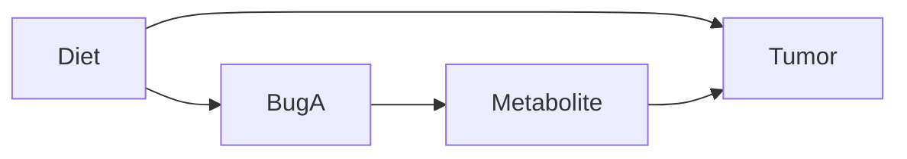

# Core Concepts: DAGs, Backdoor Criterion, and Adjustment

This document expands on the core causal concepts introduced in the main README, focusing on DAGs (Directed Acyclic Graphs), the backdoor criterion, and how to decide what variables to adjust for in regression or other models.

## DAGs Revisited

A DAG is a visual tool to represent our assumptions about causal relationships. Each arrow represents a direct causal effect.

### Our Toy DAG

- **Diet** causes changes in **BugA** and **Tumor**.
- **BugA** causes changes in **Metabolite**.
- **Metabolite** causes changes in **Tumor**.

No cycles: nothing loops back.

## Backdoor Paths

A backdoor path is a non-causal path from the exposure (X) to the outcome (Y) that starts with an arrow pointing into X.

In our DAG, for X = BugA, Y = Tumor:
- Path: BugA ← Diet → Tumor
- This starts with an arrow into BugA (from Diet), so it's a backdoor path.

Backdoor paths can create spurious associations (confounding).

## Backdoor Criterion

To estimate the causal effect of X on Y, we need to block all backdoor paths without opening new ones or blocking the direct path.

For BugA → Tumor:
- Adjust for Diet (blocks the backdoor path).
- Do not adjust for Metabolite (it's on the direct path; adjusting would block the effect we're trying to measure).

## Adjustment in Practice

In regression: Include confounders as covariates.

Example: To estimate BugA's effect on Tumor, regress Tumor ~ BugA + Diet.

This compares patients with similar Diet levels.

## Common Mistakes (Wrong Adjustment)

- **Adjusting for a mediator when you want a total effect**: If you regress `Tumor ~ BugA + Metabolite + Diet` and interpret the `BugA` coefficient as the *total* effect, you’re usually answering a different question (a *direct* effect).
- **Conditioning on a collider / selection**: If getting `Metabolite` measured depends on both `BugA` and `Tumor`, analyzing only people “with metabolomics” can create a fake association (selection bias).

## Toy DAG Adjustment Cheat-Sheet

| Question | Adjust for | Do not adjust for |
|---|---|---|
| Total effect of `BugA` on `Tumor` | `Diet` | `Metabolite` |
| Direct effect of `BugA` on `Tumor` not through `Metabolite` | `Diet`, `Metabolite` | Colliders / selection variables |
